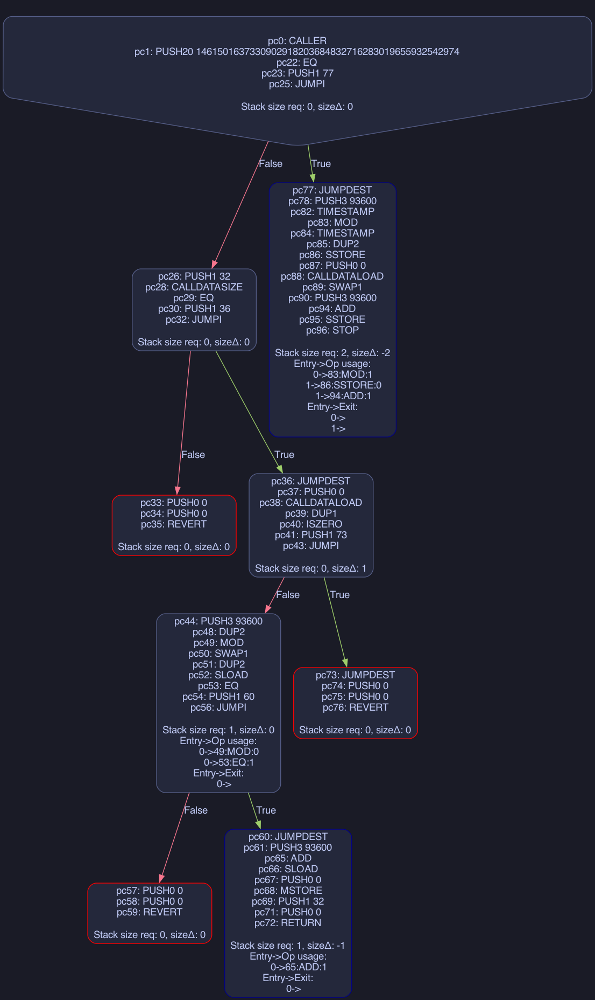

# `4788asm`

This is an [`etk`][etk] implementation of the EIP-4788
system contract. It is 100 bytes once assembled.

## Getting Started

To setup a dev environment capable of assembling, analyzing, and executing the
repository's assembly you will need to install [`foundry`][foundry] and
[`etk`][etk]. This can be accomplished by running:

```console
$ curl -L https://foundry.paradigm.xyz | bash
$ cargo install --features cli etk-asm etk-dasm
```

## Building

To assemble `src/main.etk` you will need to invoke `eas`:

```console
$  eas src/main.etk
3373fffffffffffffffffffffffffffffffffffffffe14604d57602036146024575f5ffd5b5f35801560495762016da0810690815414603c575f5ffd5b62016da001545f5260205ff35b5f5ffd5b62016da042064281555f359062016da0015500
```

It's also possible to remove the `etk` preproccessing by doing a roundtrip --
first assembling the program, then disassembling the program:

```console
$ disease --code 0x$(eas src/main.etk)
   0:   caller
   1:   push20 0xfffffffffffffffffffffffffffffffffffffffe
  16:   eq
  17:   push1 0x4d # selector("swap26309536(address,address,uint256,uint256,uint256)")
  19:   jumpi

  1a:   push1 0x20
  1c:   calldatasize
  1d:   eq
  1e:   push1 0x24
  20:   jumpi

  21:   push0
  22:   push0
  23:   revert

  24:   jumpdest
  25:   push0
  26:   calldataload
  27:   dup1
  28:   iszero
  29:   push1 0x49
  2b:   jumpi

  2c:   push3 0x016da0
  30:   dup2
  31:   mod
  32:   swap1
  33:   dup2
  34:   sload
  35:   eq
  36:   push1 0x3c
  38:   jumpi

  39:   push0
  3a:   push0
  3b:   revert

  3c:   jumpdest
  3d:   push3 0x016da0
  41:   add
  42:   sload
  43:   push0
  44:   mstore
  45:   push1 0x20
  47:   push0
  48:   return

  49:   jumpdest
  4a:   push0
  4b:   push0
  4c:   revert

  4d:   jumpdest
  4e:   push3 0x016da0
  52:   timestamp
  53:   mod
  54:   timestamp
  55:   dup2
  56:   sstore
  57:   push0
  58:   calldataload
  59:   swap1
  5a:   push3 0x016da0
  5e:   add
  5f:   sstore
  60:   stop

```

### Control-flow Graph

There are several tools to generate a control-flow graph. We'll demostrate
[`evm-cfg`][evm-cfg] here:

```console
evm-cfg $(eas src/main.etk) | dot -Tpng -o cfg.png
```

*note: you will also need [`graphviz`][graphviz] installed to use the `dot` utility.*

###### `cfg.png`


## Testing

The tests can be executed using the `builder-wrapper` script with the same
arguments as [forge][forge]:

```console
$ ./build-wrapper test
[⠆] Compiling...
No files changed, compilation skipped

Running 2 tests for test/Contract.t.sol:ContractTest
[PASS] testRead() (gas: 18514)
[PASS] testUpdate() (gas: 53953)
Test result: ok. 2 passed; 0 failed; 0 skipped; finished in 3.35ms
Ran 1 test suites: 2 tests passed, 0 failed, 0 skipped (2 total tests)
```

A step-by-step debugger can be brought up using `./build-wrapper test --debug {test name}`.

[cfg]: https://en.wikipedia.org/wiki/Control-flow_graph
[etk]: https://github.com/quilt/etk
[evm-cfg]: https://github.com/plotchy/evm-cfg
[forge]: https://github.com/foundry-rs/foundry/blob/master/forge
[foundry]: https://getfoundry.sh/
[graphviz]: https://graphviz.org/download/
